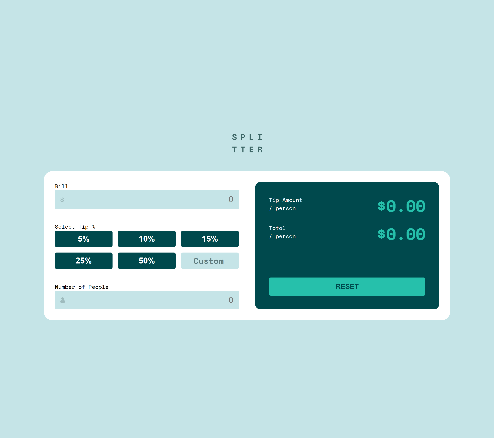
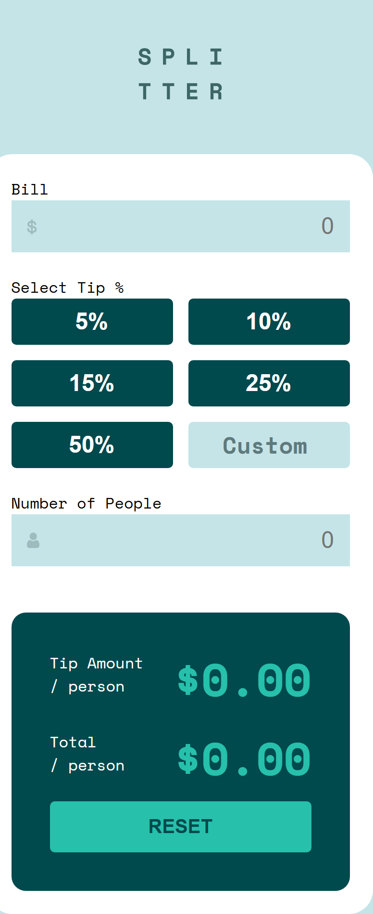
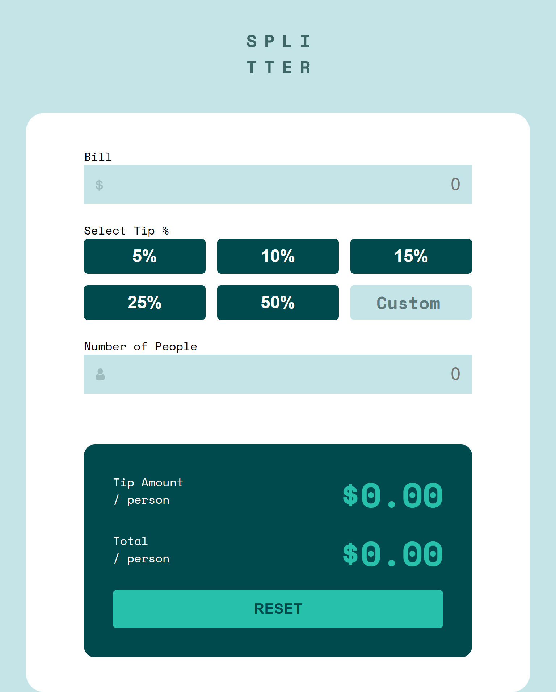

# Frontend Mentor - Tip calculator app


## Welcome! 👋

Thanks for checking out this front-end coding challenge.

[Frontend Mentor](https://www.frontendmentor.io) challenges help you improve your coding skills by building realistic projects.

**To do this challenge, you need a basic understanding of HTML, CSS and JavaScript.**

## Overview

## Table of contents

- [Overview](#overview)
  - [The challenge](#the-challenge)
  - [Screenshot](#screenshot)
  - [Links](#links)
- [My process](#my-process)
  - [Built with](#built-with)
  - [What I learned](#what-i-learned)
  - [Continued development](#continued-development)
- [Author](#author)

### The challenge

Users should be able to:

- View the optimal layout for the app depending on their device's screen size
- See hover states for all interactive elements on the page
- Calculate the correct tip and total cost of the bill per person
- View the "Can't be zero" error message when the number of people is set to 0
- Reset the calculator to its initial state

### Screenshot

| Desktop                        | Mobile               | Tablet |
| ------------------------------ | -------------------- | ---------------------- |
|  |  |  |


### Links

- Solution URL: [https://www.frontendmentor.io/solutions/tip-calculator-app-main-nNF_D7wBZb]
- Live Site URL: [https://emelinur.github.io/tip-calculator-app-main/]

## My process

### Built with

- Semantic HTML5 markup
- CSS Custom Properties
- CSS Grid & Flexbox
- Mobile-first workflow
- Vanilla JavaScript (ES6+)

### What I learned

This project was a great challenge to improve my JavaScript logic, especially regarding **Scope** and **State Management**.

One of the biggest hurdles I overcame was handling the variable scope within the calculator function. Initially, I faced `ReferenceError` issues because my variables were defined inside an `else` block but accessed outside of it. I refactored the code to ensure variables are accessible throughout the calculation logic.

I also learned how to handle **real-time updates** by using the `input` event listener instead of just `click`, making the app feel more responsive.

Here is a snippet of the reset logic I'm proud of, which clears not just the data but also the UI states and error messages:

```js
resetBtn.addEventListener("click", () => {
  // Clear Inputs
  billInput.value = "";
  peopleInput.value = "";
  btnCustom.value = "";
  
  // Reset State
  billValue = 0;
  peopleValue = 1;
  tipValue = 0;
  
  // Reset UI
  tipAmount.innerText = "$0.00";
  totalAmount.innerText = "$0.00";
  document.querySelector(".active")?.classList.remove("active");
  
  // Clear Errors
  peopleError.style.display = "none";
  peopleInput.style.border = "";
});